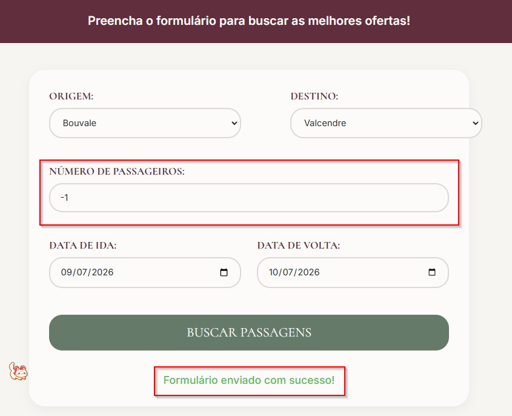
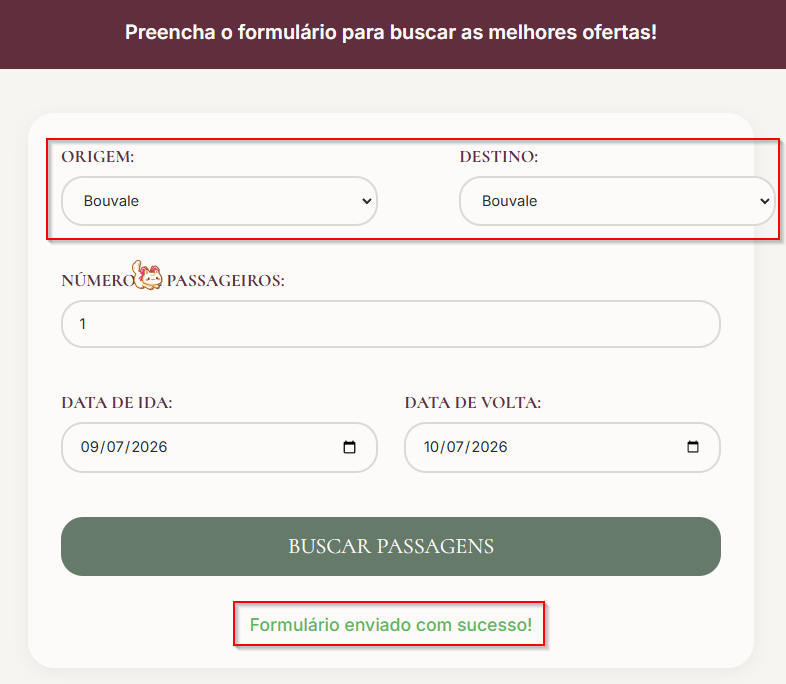
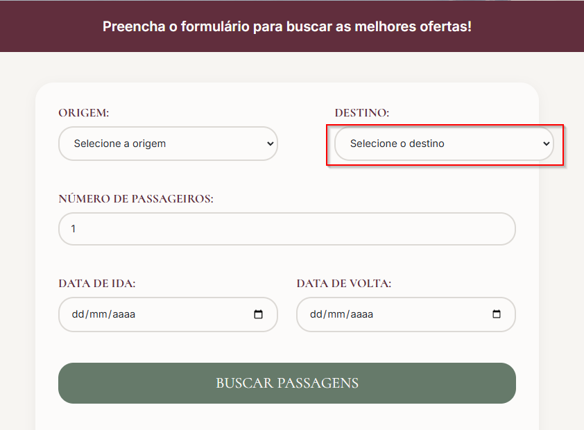

# ✦ Bisou Travel — QA Documentation ✦
### Test Cases & Defect Reports
Jesse Rother 🌸 · [GitHub](https://github.com/pink-bowie)

---

## TC01 — Busca de passagens com dados válidos

**ID:** TC01
**Pré-condições:** Estar na página index.html

**Passos:**
1. Selecionar cidades diferentes em "Origem" e "Destino"
2. Preencher datas válidas de Ida e Volta
3. Clicar em "Buscar Passagens"

**Resultado Esperado:** Mensagem "Formulário enviado com sucesso!" é exibida.
**Resultado Obtido:** Mensagem "Formulário enviado com sucesso!" foi exibida.
**Status:** ✅ Passou

---

## TC02 — "Número de Passageiros" aceita valores negativos

**ID:** TC02
**Pré-condições:** Estar na página bugs.html

**Passos:**
1. Inserir -1 em "Número de Passageiros"
2. Preencher os demais campos corretamente
3. Clicar em "Buscar Passagens"

**Resultado Esperado:** O campo não deve aceitar valores menores que 1. O formulário não deve ser enviado.
**Resultado Obtido:** Mensagem "Formulário enviado com sucesso!" foi exibida com o valor -1 no campo.
**Status:** ❌ Falhou

---

## DR01 — "Número de Passageiros" aceita valores negativos

**ID:** DR01
**Ambiente:** Chrome 127, Resolução 1920x1080
**Pré-condições:** Estar na página bugs.html
**TC Relacionado:** TC02

**Passos para Reprodução:**
1. Inserir -1 em "Número de Passageiros"
2. Preencher os demais campos corretamente
3. Clicar em "Buscar Passagens"

**Resultado Esperado:** O campo não deve aceitar valores menores que 1. O formulário não deve ser enviado.
**Resultado Obtido:** Mensagem "Formulário enviado com sucesso!" foi exibida com o valor -1 no campo.
**Evidência:**

**Prioridade:** High
**Status:** Aberto

---

## TC03 — Cidades iguais em "Origem" e "Destino"

**ID:** TC03
**Pré-condições:** Estar na página bugs.html

**Passos:**
1. Selecionar a mesma cidade em "Origem" e "Destino"
2. Preencher os demais campos corretamente
3. Clicar em "Buscar Passagens"

**Resultado Esperado:** O sistema deve bloquear a seleção de cidades iguais.
**Resultado Obtido:** Mensagem "Formulário enviado com sucesso!" foi exibida com cidades iguais selecionadas.
**Status:** ❌ Falhou

---

## DR02 — Cidades iguais em "Origem" e "Destino"

**ID:** DR02
**Ambiente:** Chrome 127, Resolução 1920x1080
**Pré-condições:** Estar na página bugs.html
**TC Relacionado:** TC03

**Passos para Reprodução:**
1. Selecionar a mesma cidade em "Origem" e "Destino"
2. Preencher os demais campos corretamente
3. Clicar em "Buscar Passagens"

**Resultado Esperado:** O sistema deve bloquear a seleção de cidades iguais.
**Resultado Obtido:** Mensagem "Formulário enviado com sucesso!" foi exibida com cidades iguais selecionadas.
**Evidência:**

**Prioridade:** High
**Status:** Aberto

---

## TC04 — Alinhamento incorreto no campo de Destino

**ID:** TC04
**Pré-condições:** Estar na página bugs.html

**Passos:**
1. Observar a posição do campo "Destino" em relação aos demais campos

**Resultado Esperado:** O campo "Destino" deve estar centralizado e alinhado verticalmente com os demais campos.
**Resultado Obtido:** O campo "Destino" está deslocado e desalinhado para a direita.
**Status:** ❌ Falhou

---

## DR03 — Alinhamento incorreto no campo de Destino

**ID:** DR03
**Ambiente:** Chrome 127, Resolução 1920x1080
**Pré-condições:** Estar na página bugs.html
**TC Relacionado:** TC04

**Passos para Reprodução:**
1. Observar a posição do campo "Destino" em relação aos demais campos

**Resultado Esperado:** O campo "Destino" deve estar centralizado e alinhado verticalmente com os demais campos.
**Resultado Obtido:** O campo "Destino" está deslocado e desalinhado para a direita.
**Evidência:**

**Prioridade:** Low
**Status:** Aberto

---

✦ Documentação elaborada por Jesse Rother 🌸
QA em formação · [github.com/pink-bowie](https://github.com/pink-bowie)